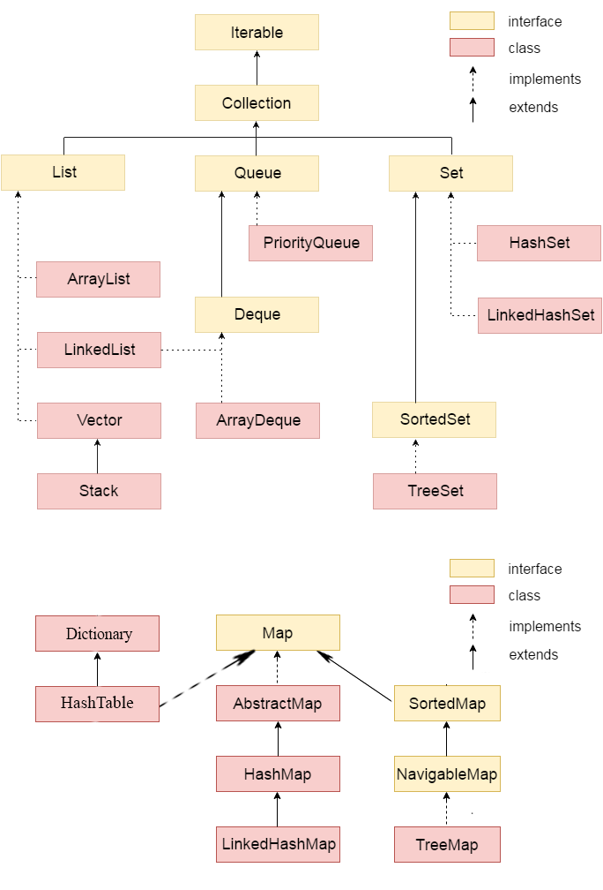

# BUỔI 7. MỘT SỐ CTDL THƯỜNG THẤY TRONG JAVA

### 1. Cấu trúc dữ liệu (CTDL) là gì?

- CTDL (Data Structures) là cách lập trình để lưu trữ dữ liệu trong máy tính sao cho nó có thể được sử dụng một cách hiệu quả.
- CTDL là một khái niệm nền tảng trong khoa học máy tính. Việc hiểu rõ về các loại CTDL và cách sử dụng chúng một cách hiệu quả là rất quan trọng để giải quyết các bài toán phức tạp và phát triển các phần mềm chất lượng cao.
- **Tại sao cần sử dụng CTDL:**
    - **Tổ chức dữ liệu:** Giúp sắp xếp dữ liệu một cách có hệ thống, dễ tìm kiếm và quản lý.
    - **Tối ưu hóa hiệu suất:** Chọn cấu trúc dữ liệu phù hợp giúp các thuật toán hoạt động hiệu quả hơn, tiết kiệm thời gian và bộ nhớ.
    - **Giải quyết các bài toán cụ thể:** Mỗi cấu trúc dữ liệu có những ưu điểm và hạn chế riêng, phù hợp với những bài toán khác nhau.
- **Ứng dụng của CTDL:**
    - **Phát triển phần mềm:** Cấu trúc dữ liệu được sử dụng rộng rãi trong việc xây dựng các ứng dụng, hệ thống, từ các ứng dụng đơn giản đến các hệ thống lớn.
    - **Xử lý dữ liệu:** Cấu trúc dữ liệu giúp xử lý, phân tích và trích xuất thông tin từ dữ liệu một cách hiệu quả.
    - **Trí tuệ nhân tạo:** Cấu trúc dữ liệu được sử dụng để xây dựng các mô hình học máy, mạng thần kinh nhân tạo.
    - **Các lĩnh vực khác:** Khoa học máy tính, Kỹ thuật, Tài chính…

### 2. Interface Iterable, Collection

- **Iterable Interface**
    - Nằm trong gói **`java.lang`**, là giao diện gốc của tất cả Collection class.
    - Collection Interface kế thừa (**`extends`**) từ Iterable Interface, và các lớp con của Collection hiện thực (**`implement`**) từ Iterable Interface.
    - **Định nghĩa Iterable**
        
        ```java
        public interface Iterable<T> {
          Iterator<T>    iterator();
          Spliterator<T> spliterator();
          void forEach(Consumer<? super T> action);
        }
        ```
        
        - Có 3 kiểu lặp có thể dùng với các đối tượng thuộc Iterable:
            1. Sử dụng enhanced for loop (for-each loop - Giống C++)
            2. Sử dụng Iterable [forEach](https://www.geeksforgeeks.org/iterable-foreach-method-in-java-with-examples/) loop
            3. Sử dụng **`Iterator<T>`** interface
    - **Các phương thức của Iterable**
        
        
        | PHƯƠNG THỨC | **CHỨC NĂNG** |
        | --- | --- |
        | [**forEach​(Consumer<? super T> action)**](https://www.geeksforgeeks.org/iterable-foreach-method-in-java-with-examples/) | Đưa ra hành động với mỗi phần tử thuộc iterable cho tới hết hoặc xuất hiện ngoại lệ. |
        | **`iterator()`** | Trả về một iterator tới các phần tử kiểu T |
        | **`spliterator()`** | Tạo một [**Spliterator](https://www.geeksforgeeks.org/java-util-interface-spliterator-java8/)** tới các phần tử được miêu tả bởi **Iterable** |
- **Collection Interface**
    - Là thành viên cốt lõi của [Java Collection Framework](https://www.geeksforgeeks.org/collections-in-java-2/), nằm trong gói **`java.util`**.
    - Là một trong các giao diện gốc của Java Collection Hierachy.
    - Collection Interface **CHỈ TRIỂN KHAI GIÁN TIẾP** thông qua các giao diện con như **`list`**, **`set`** và **`queue`**
    - **Định nghĩa Collection**
        
        ```java
        public interface Collection<E> extends Iterable<E>
        ```
        
    - **Các giao diện con của giao diện Collection**
        1. List
            - Là một tập hợp các phần tử được sắp xếp, cho phép trùng lặp. Nó được hiện thực bởi các lớp như **`ArrayList`**, **`LinkedList`** và **`Vector`**
            - Cho phép các phần tử truy cập vào chỉ mục của chúng
                
                ```java
                public interface List<E> extends Collection<E>
                ```
                
        2. Set
            - Là một tập hợp các phần tử không được sắp xếp, các phần tử không được trùng lặp. Nó được hiện thực bởi các lớp như **`HashSet`**, **`TreeSet`** và **`LinkedHashTable`**
                
                ```java
                public interface Set<E> extends Collection<E>
                ```
                
        3. Queue
            - Biểu diễn một tập hợp tuân theo nguyên tắc FIFO (First-In-First-Out). Nó được hiện thực bởi các lớp như **`PriorityQueue`**, **`Deque`** và **`ArrayDeque`**
                
                ```java
                public interface Queue<E> extends Collection<E>
                ```
                
    - **Các phương thức của Collection Interface**
        
        https://www.geeksforgeeks.org/collection-interface-in-java-with-examples/
        



Java Collection Hierachy

### 3. Tại sao trong Java lại có nhiều Collection class, nên chọn class nào để sử dụng?

- Java cung cấp nhiều lớp Collection nhằm đáp ứng các trường hợp, yêu cầu khác nhau trong quản lý dữ liệu. Một số lý do cơ bản như sau:
    1. **Đa dạng CTDL**: Các collection class khác nhau hiện thực các CTDL khác nhau (e.g: **`lists`**, **`sets`**, **`maps`**, **`queues`**) để quản lý dữ liệu hiệu quả, tùy theo mục đích sử dụng.
    2. **Thời gian thực thi**: Các collection class có thời gian thực thi khác nhau với mỗi chức năng như thêm (**insetion**), xóa (**deletion**), truy cập (**access**).
    3. **Thứ tự và sắp xếp**: Một số CTDL duy trì thứ tự ban đầu (e.g: **`TreeSet`**, **`TreeMap`**) , một số thì không (e.g: **`HashSet`**, **`HashMap`**), cho phép dev lựa chọn một collection dựa trên sự cần thiết về tính giữ nguyên thứ tự.
    4. **Vấn đề bảo mật**: Java cung cấp một số phiên bản đồng bộ của collection (e.g: **`Vector`**, **`HashTable`**, **`Collections.synchronizedList()`**…) trong trường hợp cần truy cập an toàn
    5. **Cho các trường hợp cụ thể**: (**`PriorityQueue`**: Cần xử lý theo thứ tự ưu tiên; **`EnumSet`**: Áp dụng cho các **`set`** kiểu **`enum`**, cải thiện hiệu năng tối ưu bộ nhớ)
    6. **Tính linh hoạt và mở rộng (*Flexibility and Extensibility*)**
- Tùy vào mục đích, yêu cầu về chức năng, chương trình mà ta lựa chọn class khác nhau.

### 4. Comparable và Comparator

**COMPARABLE**

- Được sử dụng để định nghĩa thứ tự tự nhiên của các đối tượng cho 1 lớp do người dùng định nghĩa.
- Nằm trong gói **`java.lang`**, cung cấp phương thức **`compareTo()`** để so sánh
- Một lớp phải **`implements`** 1 Comparable Interface để định nghĩa thứ tự tự nhiên.
- **Định nghĩa một Comparable Interface**
    
    ```java
    public interface Comparable<T> {
        int compareTo(T obj);
    }
    ```
    
    - Hàm này so sánh đối tượng hiện tại với đối tượng được chỉ định
    - Kết quả trả về:
        - $<0$: Nếu `currentObj < specifiedObj`
        - $0$: Nếu `currentObj == specifiedObj`
        - $>0$: Nếu `currentObj > specifiedObj`
        
- **Ứng dụng của Comparable Interface**
    - Sắp xếp lại thứ tự của một mảng chữ số/các cặp
        
        ```java
        import java.util.*;
        
        class Pair implements Comparable<Pair> {
            String s; // String 
            int v;    // Integer 
            // Constructor 
            public Pair(String s, int v) {
                this.s = s;
                this.v = v;
            }
        
            // toString() method for displaying the Pair
            @Override
            public String toString() {
                return "(" + s + ", " + v + ")";
            }
        
            // compareTo() method for comparison logic
            @Override
            public int compareTo(Pair p) {      
                // Compare based on the string field (lexicographical order)
                if(this.s.compareTo(p.s) != 0) {
                    return this.s.compareTo(p.s);
                } 
                // If strings are the same, compare based on the integer value
                return this.v - p.v;
            }
        
            public static void main(String[] args) {
                Pair[] p = {
                    //members
                };
                System.out.println("Before Sorting:");
                for (Pair p1 : p) {
                    System.out.println(p1);
                }
                Arrays.sort(p); //Hàm sort của Arrays
                System.out.println("\nAfter Sorting:");
                for (Pair p1 : p) {
                    System.out.println(p1);
                }
            }
        }
        ```
        

**COMPARATOR**

- Được sử dụng để sắp xếp các đối tượng của các lớp do người dùng định nghĩa.
- Một đối tượng Comparator có khả năng so sánh 2 đối tượng của cùng một lớp.
- **Định nghĩa hàm `compare()`**
    
    ```java
    public int compare(Object obj1, Object obj2):
    ```
    
- **Phương pháp triển khai giao diện Comparator**
    
    > *Giả sử chúng ta có một Array/ArrayList thuộc loại lớp của riêng mình, chứa các trường như số báo danh, tên, địa chỉ, ngày sinh, v.v. và chúng ta cần sắp xếp mảng dựa trên số báo danh hoặc tên?*
    > 
    1. Sử dụng hàm **`sort()`**: Cần phải viết lại toàn bộ hàm sắp xếp cho các tiêu chí so sánh khác nhau.
    2. Sử dụng giao diện Comparator: Gồm 2 phương thức `compare(Object obj1, Object obj2)` và `equals(Object elements)`. Qua đó, ta có thể sắp xếp các phần tử dựa trên các dữ liệu thành viên.
- **Cách phương thức Collections.sort() hoạt động?**
    - Được dùng để sắp xếp các phần tử của **`List`** thông qua comparator
        
        ```java
        public void sort(List list, ComparatorClass c)
        ```
        
    - Để sắp xếp được, `ComparatorClass` phải **`implements`** một giao diện Comparator.
    - Hàm sort sẽ gọi phương thức **`compare`** để so sánh xem cái nào lớn hơn, kết quả trả về tương tự phương thức **`compareTo()`**
    - Ta có thể sử dụng comparator để sắp xếp theo nhiều dữ liệu thành viên.
        
        ```java
        // Using Comparator Interface Via More than One Field
        import java.util.*;
        
        class Student {
            String name;
            Integer age;
        
            Student(String name, Integer age) {
                this.name = name;
                this.age = age;
            }
        
            public String getName() { return name; }
            public Integer getAge() { return age; }
        
             // Method to print student details in main()
            @Override
            public String toString() {
                return name + " : " + age;
            }
        }
        
        // Comparator in a Helper Class
        class CustomerSortingComparator implements Comparator<Student> {
            // Compare first by name, then by age
            public int compare(Student customer1, Student customer2) {
                 // Compare by name first
                int NameCompare = customer1.getName().compareTo(
                                          customer2.getName());
                // If names are the same, compare by age
                int AgeCompare = customer1.getAge().compareTo(
                                          customer2.getAge());
                // Return the result: first by name, second by age
                return (NameCompare == 0) ? AgeCompare : NameCompare;
            }
        }
        
        public class ComparatorHelperClassExample {
            public static void main(String[] args) {
                List<Student> students = new ArrayList<>();
        				//Adding members ...
        
                System.out.println("Original List ");
                for (Student it : students) {
                    System.out.println(it);
                }
                System.out.println();
                // Sort students by name, then by age
                // using the CustomerSortingComparator
                Collections.sort(students, new CustomerSortingComparator());
                
                System.out.println("After Sorting ");
                for (Student it : students) {
                    System.out.println(it);
                }
            }
        }
        ```
        
        Ngoài ra, ta có thể sử dụng đoạn code sau để so sánh mà không cần gọi lớp `CustomerSortingComparator` :
        
        ```java
        students.sort(Comparator.comparing(Student::getName)
        														.thenComparing(Student::getAge));
        ```
        

| Tính năng | Comparator | Comparable |
| --- | --- | --- |
| Vị trí thiết lập logic sắp xếp | Bên ngoài class | Trong class |
| Nhiều thứ tự sắp xếp | Hỗ trợ | Không hỗ trợ |
| Phương thức giao diện | **`compare()`** | **`compareTo()`** |
| Giao diện chức năng | Có | Không |
| Ứng dụng | Linh hoạt và có thể tái sử dụng | Đơn giản và kết hợp chặt chẽ |
