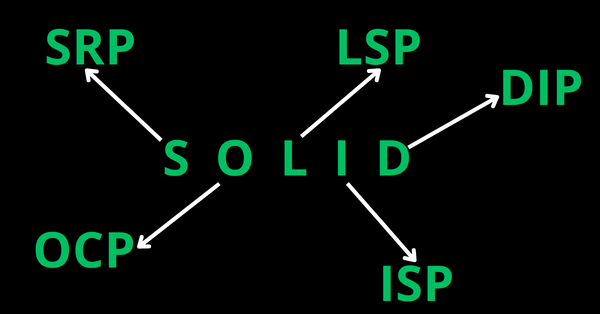

# BUỔI 9. SOFTWARE DESIGN NHẬP MÔN

### SOLID

- **Khái niệm**
    
    
    - **SOLID** là 5 chữ cái đầu trong 5 nguyên tắc thiết kế hướng đối tượng, giúp cho developer viết ra những đoạn code dễ đọc, dễ hiểu, dễ duy trì, được đưa ra bởi Bob Martin và Michael Feathers.
    - Mỗi nguyên tắc sẽ giải quyết một vấn đề cụ thể, có thể xuất hiện trong quá trình xây dụng, phát triển phần mềm.
    - Các nguyên tắc trong **SOLID** như sau:
        1. **S**ingle responsibility principle (SRP)
        2. **O**pen/Closed principle (OCP)
        3. **L**iskov substitution principe (LSP)
        4. **I**nterface segregation principle (ISP)
        5. **D**ependency inversion principle (DIP)
    
    
    
- **Single Responsibility Principle (SRP)**
    
    Trách nhiệm duy nhất (Single Responsibility), gồm có 2 nguyên tắc chính sau:
    
    1. *Lớp/module/phương thức chỉ nên có một lý do duy nhất để thay đổi.*
    2. *Lớp/module/phương thức chỉ nên giữ một trách nhiệm duy nhất (một chức năng cụ thể)*
    
    Một class có quá nhiều chức năng sẽ trở nên cồng kềnh và trở nên khó đọc, khó quản lý và bảo trì.
    
    Để hiểu rõ hơn về nguyên tắc này, ta sẽ đi vào một ví dụ cụ thể (Source: [gfg](https://www.geeksforgeeks.org/single-responsibility-in-solid-design-principle/)):
    
    - Giả sử ta đang có một lớp tên Invoice, gồm 4 phương thức là **`addInvoice()`**, **`deleteInvoice()`**, **`GenerateReport()`** và **`EmailReport()`**. Mô hình của lớp được miêu tả bởi đoạn mã giả:
        
        
        ```java
        public class Invoice {
            public void AddInvoice() { 
                // your logic
            }
            public void DeleteInvoice() {
                // your logic
            }
            public void GenerateReport() {
                // your logic
            }
            public void EmailReport() {
                // your logic
            }
        }
        ```
        
        
        
    - Theo **SRP**, các phương thức trong hàm đều chỉ có một chức năng duy nhất, nhưng lớp Invoice thì không, vì nó vẫn đang giữ nhiều trách nhiệm (tương ứng với 4 phương thức) và điều này đang đi ngược lại nguyên tắc **SRP**. Do đó, ta phải tách các phương thức này vào các lớp riêng, mỗi lớp nắm giữ một chức năng duy nhất, khi đó mới đảm bảo đúng nguyên tắc.
    - Do hai phương thức **`addInvoice()`** và **`deleteInvoice()`** có chức năng gần tương tự nhau nên ta đưa chúng vào chung một lớp. Hai phương thức còn lại có chức năng khác nhau nên ta sẽ đưa vào hai lớp riêng biệt. Minh họa về các lớp và mã giả sau khi đượcxử lý ở dưới đây:
        
        
        ```java
        public class Invoice {
            public void AddInvoice() {
                // your logic
            }
            public void DeleteInvoice() {
                // your logic
            }
        }
        
        public class Report {
            public void GenerateReport() {
                // your logic
            }
        }
        
        public class Email {
            public void EmailReport() {
                // your logic
            }
        }
        ```
        
        
        
        
        
- **Open/Closed principle (OCP)**
    - Nguyên tắc mở/đóng (Open/Closed principle) nêu rằng: *Có thể thoải mái mở rộng 1 class/module/hàm nhưng không được sửa đổi bên trong class/module/hàm đó **(open for extension but closed for modification)***
    - Nguyên lý này sẽ tạo ra nhiều class nhưng sẽ đảm bảo việc class cũ sẽ không bị ảnh hưởng hay thay đổi, từ đó sẽ đỡ tốn thời gian test lại class cũ đó.
    - Nghe có vẻ mâu thuẫn, nhưng ta có thể đạt được nguyên tắc này bằng cách sử dụng kế thừa và đa hình.
- **Liskov Substitution Principle (LSP)**
    - Đây là một trong những nguyên tắc quan trọng nhất cần phải tuân thủ trong hướng đối tượng.
    - Bất cứ instance nào của class cha cũng có thể được thay thế bởi instance của class con của nó mà không làm thay đổi tính đúng đắn của chương trình

### KISS, DRY, YAGNI

- **KISS**
    - **Keep It Simple, Stupid** - **KISS** là nguyên tắc được được đặt ra bởi Kelly Johnson, với ý nghĩa nhấn mạnh tầm quan trọng của sự đơn giản trong các đoạn code.
    - Đoạn code càng đơn giản thì khả năng để đọc và hiểu được đoạn code đó càng nhanh, càng đơn giản càng dễ dàng để bảo trì cũng như thay đổi trong tương lai, việc này sẽ giúp tiết kiệm thời gian hơn rất nhiều.
        
        > *Code càng tinh gọn, dễ hiểu thì khả năng áp dụng của nó càng mạnh mẽ.*
        > 
    - Những cách để áp dụng **KISS**:
        - Không lạm dụng các design parttern, các thư viện nếu như không cần thiết.
        - Phân loại nhỏ bài toán lớn ra thành các bài toán nhỏ hơn để xử lý ➔ làm mọi thứ đơn giản hơn.
        - Đặt tên biến, phương thức một cách rõ ràng, dễ đọc.
- **DRY**
    - **Don't Repeat Yourself** - **DRY**, được xây dựng bởi Andrew Hunt và David Thomas, là một nguyên tắc quen thuộc và cốt lõi trong ngành lập trình.
    - Nguyên tắc này giúp cho các phần của code **ít bị lặp lại hơn**, dễ dàng và nhanh chóng thay đổi các đoạn code (chỉ cần thay đổi ở một nơi mà không cần phải thay đổi ở nhiều nơi) từ đó giảm thiểu thời gian phát triển phần mềm.
        
        > *DRY muốn nhấn mạnh đến việc nên tái sử dụng lại code hết mức có thể*
        > 
    - Áp dụng: Bất cứ khi nào có một đoạn mã được sử dụng 2 lần ở những nơi khác nhau thì nên đóng gói lại đoạn mã đó (tạo hàm, tạo class, ...) để sau này có thể tái sử dụng.
- **YAGNI**
    - **You Aren't Gonna Need It** - **YAGNI** là nguyên tắc chú trọng đến việc không nên làm phức tạp hóa một yêu cầu bằng các giả định trong tương lai.
    - Việc giả định các chức năng và code chúng sẽ gây ra **rất nhiều sự lãng phí về thời gian, tiền bạc cũng như công sức** của team (review code, testing, ...) và đôi khi sẽ không thu lại được gì → Nên dành thời gian phát triển các chức năng cần thiết ở hiện tại.
        
        > *Đừng giả định và xây dựng các chức năng của một phần mềm trước khi cần dùng tới nó*
        > 
    - Phạm vi của nguyên tắc này **chỉ nói đến các chức năng nghiệp vụ** của phần mềm chừ **không phải các yêu cầu kĩ thuật của phần mềm**. Một source code của phần mềm vẫn cần phải tuân thủ theo các nguyên tắc thiết kế (Clean code, SOLID) để đảm bảo tính linh hoạt cho phần mềm.

### Mô hình MVC

- **Tìm hiểu mô hình MVC**
    
    
    - **Model-View-Controller** - **MVC** là mô hình thiết kế được sử dụng trong kỹ thuật phần mềm, để tạo lập giao diện người dùng trên máy tính.
    - MVC chia thành *ba phần* được *kết nối với nhau* và mỗi thành phần đều có một nhiệm vụ **riêng** của nó và **độc lập** với các thành phần khác.
    - Mô hình MVC cổ điển hiện tại ít được sử dụng trong môi trường lập trình desktop như trước đây nhưng hiện tại nó vẫn được sử dụng cực kì rộng rãi như là kiến trúc cơ bản trong các môi trường lập trình web.
    - MVC cũng được sử dụng rộng rãi trong phát triển **web**, *sự khác biệt được tùy chỉnh liên quan đến sự có mặt của **server - client***.
    
    
    
    Tổng quan mô hình MVC
    
- **MVC hoạt động như thế nào?**
    
    
    - Thông thường, chúng ta biết rằng mô hình MVC gồm 3 thành phần: Model, View và Controller
        - **View** – Nơi người dùng tương tác.
        - **Controller** – Xử lý yêu cầu và gửi phản hồi đến view.
        - **Model** – Middleware xử lý các thao tác cơ sở dữ liệu.
    - **View**
        - View đại diện cho cách dữ liệu được trình bày trong ứng dụng (UI). Các view được tạo ra dựa trên dữ liệu thu thập từ model.
        - Bằng cách yêu cầu thông tin từ model, sau đó sẽ trả kết quả tới người dùng.
        - Ngoài việc hiển thị dữ liệu từ các biểu đồ, sơ đồ và bảng, view còn hiển thị dữ liệu từ các nguồn khác.
    - **Controller**
        - Controller là thành phần xử lý tương tác của người dùng.
        - Dữ liệu đầu vào của người dùng được controller phân tích và xử lí. Khi người dùng thao tác bất kì với hệ thống, controller sẽ gửi thông tin đến **model** để xử lí và sau đó trả về kết quả **view**.
            
            > *Người dùng -tương tác-> Controller => Model => View (output) -trả kết quả-> Người dùng*
            > 
    - **Model**
        - Model là nơi lưu trữ dữ liệu và logic.
        - Nó thao tác dữ liệu và gửi lại cơ sở dữ liệu, hoặc được sử dụng để hiển thị thông tin tương tự.
        - Ngoài ra, nó phản hồi các yêu cầu từ view và có các chỉ thị từ controller cho phép nó tự cập nhật.
        - Nó cũng là mức thấp nhất của mô hình chịu trách nhiệm duy trì dữ liệu.
    
    
    
- **Ưu, nhược điểm của MVC**
    
    
    | STT | Ưu điểm | Nhược điểm |
    | --- | --- | --- |
    | 1 | Mã nguồn dễ bảo trì và mở rộng | Khó đọc, thay đổi và kiểm thử đơn vị vì không có thành phần riêng biệt để xử lý giao diện người dùng (UI). Tất cả phải được thực hiện trên lớp view. Vì vậy, cần phải phụ thuộc vào một framework khác để làm điều đó. |
    | 2 | Các thành phần có thể kiểm tra độc lập | Không hỗ trợ xác thực chính thức |
    | 3 | Hỗ trợ các loại KH mới dễ dàng hơn | Xử lý dữ liệu có thể không hiệu quả |
    | 4 | Phát triển song song các thành phần | Khó sử dụng với giao diện người dùng hiện nay |
    | 5 | Giảm bớt độ phức tạp | Cần duy trì nhiều mã trong bộ điều khiển |
    | 6 | Sử dụng mô hình Front Controller |  |
    | 7 | Hỗ trợ phát triển theo hướng kiểm thử tối đa |  |
    | 8 | Dễ dàng cho các nhóm phát triển lớn |  |
    | 9 | Kiểm tra từng lớp và đối tượng riêng biệt |  |
    | 10 | Hành động của bộ điều khiển có thể nhóm logic |  |

### Các thành phần chính trong lập trình giao diện

- Lập trình giao diện (User Interface - UI) là quá trình thiết kế và xây dựng các thành phần tương tác giữa người dùng và phần mềm. Một giao diện người dùng tốt cần đảm bảo tính trực quan, dễ sử dụng và đáp ứng được nhu cầu của người dùng.
- **Các thành phần chính trong lập trình giao diện**
    1. **Ngôn ngữ đánh dấu (Markup Languages)**
        - **HTML (HyperText Markup Language):** Ngôn ngữ cơ bản để xây dựng cấu trúc và nội dung của giao diện người dùng trên web.
        - **XML (Extensible Markup Language):** Ngôn ngữ đánh dấu mở rộng cho phép định nghĩa các thẻ và cấu trúc dữ liệu tùy chỉnh.
    2. **Ngôn ngữ định kiểu (Style Languages)**
        - **CSS (Cascading Style Sheets):** Ngôn ngữ được sử dụng để định dạng và tạo kiểu cho các phần tử HTML, giúp giao diện trở nên đẹp mắt và chuyên nghiệp hơn.
    3. **Ngôn ngữ lập trình**
        - **JavaScript:** Ngôn ngữ lập trình mạnh mẽ được sử dụng để thêm tính tương tác và động cho giao diện người dùng trên web.
        - **Python:** Một ngôn ngữ đa năng được sử dụng trong nhiều lĩnh vực, bao gồm cả lập trình giao diện với các thư viện như Tkinter, PyQt.
        - **Java:** Một ngôn ngữ phổ biến được sử dụng để phát triển ứng dụng desktop với các thư viện như Swing, JavaFX.
        - **C#:** Ngôn ngữ lập trình của Microsoft được sử dụng để phát triển ứng dụng Windows với Windows Forms, WPF.
    4. **Các thư viện và framework**
        - **React, Angular, Vue.js:** Các thư viện và framework JavaScript phổ biến giúp xây dựng giao diện người dùng phức tạp và hiệu quả hơn.
        - **jQuery:** Một thư viện JavaScript đơn giản giúp đơn giản hóa các tác vụ liên quan đến DOM (Document Object Model) và AJAX.
        - **Bootstrap:** Một framework CSS phổ biến cung cấp các thành phần giao diện được thiết kế sẵn, giúp tiết kiệm thời gian phát triển.
    5. **Các công cụ thiết kế giao diện**
        - **Figma, Sketch, Adobe XD:** Các công cụ thiết kế giao diện chuyên nghiệp giúp các nhà thiết kế tạo ra các bản thiết kế giao diện đẹp mắt và chi tiết.
        - **Adobe Photoshop, GIMP**: Các công cụ chỉnh sửa ảnh được sử dụng để tạo và chỉnh sửa các hình ảnh, biểu tượng trong giao diện.
- **Ngoài ra, còn có một số thành phần khác cũng quan trọng trong lập trình giao diện**
    - **Các thành phần giao diện người dùng (UI components):** Nút, hộp văn bản, danh sách, bảng, biểu đồ...
    - **Thiết kế trải nghiệm người dùng (User Experience - UX):** Đảm bảo giao diện dễ sử dụng, thân thiện và đáp ứng được nhu cầu của người dùng.
    - **Khả năng truy cập (Accessibility):** Đảm bảo giao diện có thể được sử dụng bởi tất cả mọi người, bao gồm cả những người khuyết tật.
